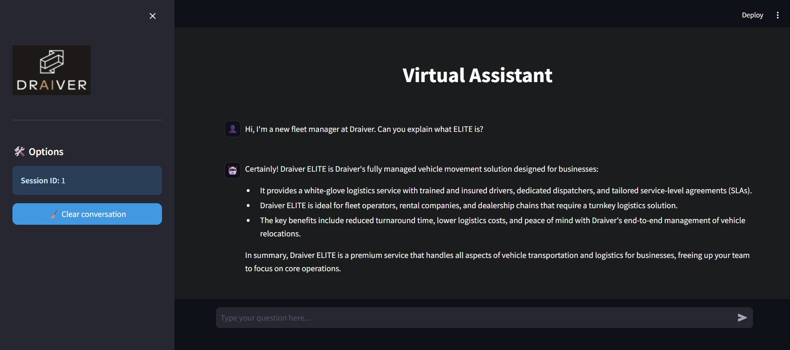

# 🤖 RAG Agent - DraiverBot

[](https://www.python.org/)
[](https://fastapi.tiangolo.com/)
[](https://streamlit.io/)
[](https://github.com/facebookresearch/faiss)
[](https://www.anthropic.com/)



## ⚡ Project Overview

**DraiverBot** is an intelligent assistant designed for vehicle logistics platforms that combines **Retrieval-Augmented Generation (RAG)** with **tool usage capabilities**. This project demonstrates a complete AI solution that can answer questions from a knowledge base while executing specific actions like checking driver status, calculating routes, and creating support tickets.

This system showcases:
- 📚 **Knowledge Retrieval**: RAG implementation using FAISS and local embeddings
- 🛠️ **Tool Integration**: Three functional tools for logistics operations
- 💾 **Session Memory**: In-memory conversation history management
- 🚀 **Modern Stack**: FastAPI backend with Streamlit frontend

## 🚀 Setup Instructions

### 1. Create Virtual Environment
```bash
python3.11 -m venv venv
source venv/bin/activate  # On Windows: venv\Scripts\activate
```

### 2. Install Dependencies
```bash
pip install -r requirements.txt
```

### 3. Load Knowledge Base
```bash
# Initial setup
python load_data.py

# Force rebuild (if needed)
python load_data.py --force
```

### 4. Run Backend (FastAPI Server)
```bash
python main.py
# Server will start on http://localhost:8000
```

### 5. Run Frontend (Streamlit Interface)
```bash
streamlit run frontend/app.py
# Interface will be available at http://localhost:8501
```

## 🧠 RAG Flow

The system implements the following RAG pipeline:

1. **Document Processing**: Knowledge base (`data/knowledge.md`) is processed using recursive chunking with natural separators (paragraphs → sentences → words)

2. **Embeddings Generation**: Text chunks are embedded using BGE-small-en-v1.5 model locally to avoid external API dependencies

3. **Vector Storage**: Embeddings are stored in FAISS index for efficient similarity search

4. **Retrieval**: User queries are embedded and matched against the knowledge base using cosine similarity

5. **Generation**: Retrieved context is combined with the user query and sent to Claude for response generation

## 🛠️ Tools

DraiverBot includes three specialized tools for logistics operations:

### 1. `get_driver_status`
- **Purpose**: Check current status and ETA of specific drivers
- **Input**: `driver_id` (string)
- **Output**: Driver availability and estimated arrival time

### 2. `calculate_eta`
- **Purpose**: Calculate route time and distance between locations
- **Input**: `origin` and `destination` (strings)
- **Output**: Estimated travel time and distance

### 3. `create_support_ticket`
- **Purpose**: Generate support tickets for user issues
- **Input**: `user_email` and `message` (strings)
- **Output**: Ticket ID and creation status

*Note: Tools currently return mock data for demonstration purposes.*

## 💬 Example Prompts

### RAG-focused Queries
- "Which types of companies benefit most from Draiver ELITE?"
- "What makes Draiver IQ different from traditional fleet software?"
- "List the integrations supported by Draiver’s platform."

### Tool-focused Queries
- "Check the status of driver D12345"
- "Calculate the ETA from Downtown Miami to Miami Airport"
- "Create a support ticket for user@example.com about payment issues"

## 🧩 Design Decisions & Trade-offs

### ✅ **RecursiveChunking vs Simple Sliding Window**
- Implemented recursive chunking with natural separators (paragraphs, sentences, words) to preserve semantic meaning
- Better context preservation compared to arbitrary text splitting

### ✅ **Local Embeddings (BGE-small-en-v1.5)**
- Chose local embedding model to avoid external API dependencies and costs
- BGE-small provides good performance while being lightweight and fast

### ✅ **FAISS Vector Store**
- Selected FAISS for efficient similarity search and easy local deployment
- CPU-optimized version for compatibility across different environments

### ✅ **In-Memory Session Management**
- Simple dictionary-based memory for conversation history
- Trade-off: scalability vs simplicity for assessment scope

### ✅ **Mock Tool Logic**
- Implemented realistic tool schemas with dummy responses
- Focus on architecture and integration rather than external system complexity

## 🔮 Future Improvements

### 🎯 **Enhanced Retrieval**
- **Re-ranking**: Implement cross-encoder models for better result relevance
- **Hybrid Search**: Combine semantic and keyword-based retrieval
- **Query Expansion**: Use synonyms and related terms for better matching

### 📄 **Advanced Chunking**
- **Semantic Chunking**: Split based on topic boundaries using embeddings
- **Agentic Chunking**: LLM-powered intelligent text segmentation
- **Multi-modal Support**: Handle images, tables, and structured data
